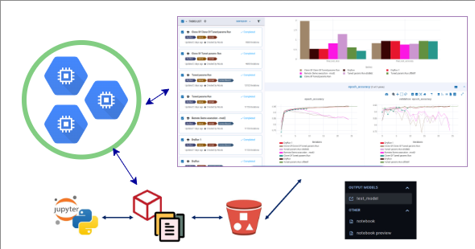

# JupyterHub, MinIO, ClearML & ClearML Agent on Kubernetes

A complete deployment setup for running _JupyterHub_ on **Kubernetes** with PostgreSQL backend, **MinIO object storage**, **ClearML experiment tracking and model management**, **ClearML Agent** for distributed ML workloads, **MetalLB load balancing**, and NGINX ingress controller.

This configuration supports both local development with Minikube and production bare-metal deployments.



## 🏗️ Architecture

This setup includes:
- **JupyterHub**: Multi-user Jupyter notebook server
- **MinIO**: S3-compatible object storage for artifacts and data
- **ClearML**: Complete MLOps platform for experiment tracking, model management, and pipeline orchestration
- **ClearML Agent**: Distributed workers for executing ML experiments and tasks
- **PostgreSQL**: Persistent database backend for JupyterHub and ClearML
- **NGINX Ingress Controller**: HTTP/HTTPS routing and load balancing
- **MetalLB**: Load balancer implementation for bare-metal Kubernetes clusters

## 📁 Repository Structure

```
├── configs/
│   ├── jupyter-values.yaml         # JupyterHub Helm configuration
│   ├── minio-values.yaml          # MinIO storage configuration
│   ├── clearml-values.yaml        # ClearML server configuration
│   ├── clearml-agent.yaml         # ClearML agent deployment
│   ├── clearml-configmaps.yaml    # ClearML configuration maps
│   ├── clearml-pvc.yaml           # ClearML persistent volume claims
│   └── postgresql-values.yaml     # PostgreSQL database configuration
├── certs/
│   └── clearml-tls.yaml           # TLS certificates for ClearML
├── metallb-helm-config/
│   ├── metallb-config.yaml        # MetalLB IP pool configuration
│   └── values.yaml               # MetalLB Helm values
├── sample-scripts/
│   ├── jupyter-minio-integration.ipynb
│   └── jupyter-minio-mlflow-integration.ipynb
└── README.md
```

## 🚀 Quick Start

### Prerequisites

- Kubernetes cluster (Minikube for local development)
- Helm 3.x installed
- kubectl configured to access your cluster

---

## 📦 Installation Steps

### 1. Add Required Helm Repositories

```bash
helm repo add ingress-nginx https://kubernetes.github.io/ingress-nginx
helm repo add jupyterhub https://jupyterhub.github.io/helm-chart/
helm repo add metallb https://metallb.github.io/metallb
helm repo add bitnami https://charts.bitnami.com/bitnami
helm repo add minio https://charts.min.io/
helm repo add clearml https://clearml.github.io/clearml-helm-charts
helm repo update

```

### 2. Install NGINX Ingress Controller

```bash
# Install NGINX Ingress Controller
helm install ingress-nginx ingress-nginx/ingress-nginx

# Optional: Download chart for customization
helm pull ingress-nginx/ingress-nginx --untar
```

### 3. Setup MetalLB Load Balancer

```bash
# Create dedicated namespace
kubectl create namespace metallb-system

# Install MetalLB
helm install metallb metallb/metallb \
  --namespace metallb-system \
  -f metallb-helm-config/values.yaml

# Configure IP address pool
kubectl apply -f metallb-helm-config/metallb-config.yaml
```

### 4. Install PostgreSQL Database

```bash
# Install PostgreSQL with custom configuration
helm install postgresql bitnami/postgresql \
  --namespace jupyter \
  --create-namespace \
  -f configs/postgresql-values.yaml
```

### 5. Install JupyterHub

```bash
# Install JupyterHub with PostgreSQL backend
helm upgrade --install jupyter jupyterhub/jupyterhub \
  --namespace jupyter \
  --create-namespace \
  -f configs/jupyter-values.yaml

# Optional: Download chart for reference
helm pull jupyterhub/jupyterhub --untar
```

### 6. Install MinIO Object Storage

```bash
# Install MinIO with custom configuration
helm install minio minio/minio \
  --namespace minio \
  --create-namespace \
  -f configs/minio-values.yaml
```

### 7. Prepare ClearML Installation Resources

Before installing ClearML server, apply the necessary preparation resources:

```bash
# Create TLS certificates for ClearML
kubectl apply -f certs/clearml-tls.yaml

# Create ClearML persistent volumes
kubectl apply -f configs/clearml-pvc.yaml

# Create ClearML configuration maps
kubectl apply -f configs/clearml-configmaps.yaml
```

### 8. Install ClearML Server

```bash
# Install ClearML server
helm upgrade --install clearml clearml/clearml \
  --namespace clearml \
  --create-namespace \
  -f configs/clearml-values.yaml
```

### 9. Install ClearML Agent Workers

```bash
# Create namespace for ClearML workers
kubectl create namespace clearml-workers

# Deploy ClearML agents
kubectl apply -f configs/clearml-agent.yaml
```

**Important**: Before deploying ClearML agents, you must:
1. Access ClearML web UI at `https://app.clearml.local`
2. Go to Settings → Workspace → App Credentials
3. Create new API credentials (access_key and secret_key)
4. Update the credentials in `configs/clearml-agent.yaml` at lines 63-64
5. The same credentials should be used in other services that need to connect to ClearML

### 10. Setup and Testing

1. **Create MinIO buckets for ClearML**:
   - `clearml-artifacts` - for experiment artifacts
   - `clearml-models` - for model storage

2. **Configure ClearML credentials across services**:
   - Generate API credentials from ClearML web UI
   - Update credentials in `configs/clearml-agent.yaml`
   - Use the same credentials in any Jupyter notebooks or client applications

3. **Test the setup**:
   - Use the provided Jupyter notebook samples
   - Run ML experiments and verify they appear in ClearML UI
   - Check that artifacts are stored in MinIO

---

## 🌐 Access Services

### Local Development (Minikube)

1. **Configure local DNS** - Add to your `/etc/hosts` file:
   ```
   <CLUSTER_IP> jupyter.local minio.local minio-console.local app.clearml.local api.clearml.local files.clearml.local
   ```

2. **Service URLs**:
   
  |   Service       | URL                        |
  |-----------------|----------------------------|
  | JupyterHub      | http://jupyter.local       |
  | MinIO Console   | http://minio-console.local |
  | MinIO API       | http://minio.local         |
  | ClearML Web UI  | https://app.clearml.local  |
  | ClearML API     | https://api.clearml.local  |
  | ClearML Files   | https://files.clearml.local|

### Production Access

For production deployments, update the ingress configurations in the values files to use your actual domain names and configure proper TLS certificates.

---

## 📚 References

- [JupyterHub Documentation](https://jupyterhub.readthedocs.io/)
- [JupyterHub Helm Chart](https://jupyterhub.github.io/helm-chart/)
- [MinIO Documentation](https://min.io/docs/)
- [ClearML Documentation](https://clear.ml/docs/)
- [ClearML Agent Documentation](https://clear.ml/docs/latest/docs/clearml_agent/)
- [PostgreSQL Bitnami Chart](https://github.com/bitnami/charts/tree/main/bitnami/postgresql)
- [MetalLB Documentation](https://metallb.universe.tf/)
- [NGINX Ingress Controller](https://kubernetes.github.io/ingress-nginx/)
